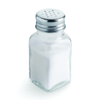

# SaltLib
SaltLib aims to be an alternative of the Sodium mod for Minecraft, but for legacy versions (1.3.2-1.13.2) of the game.

**Performance:**
  Currently doubles fps, but, because fps is still very spikey, it can jump up to triple as well.
